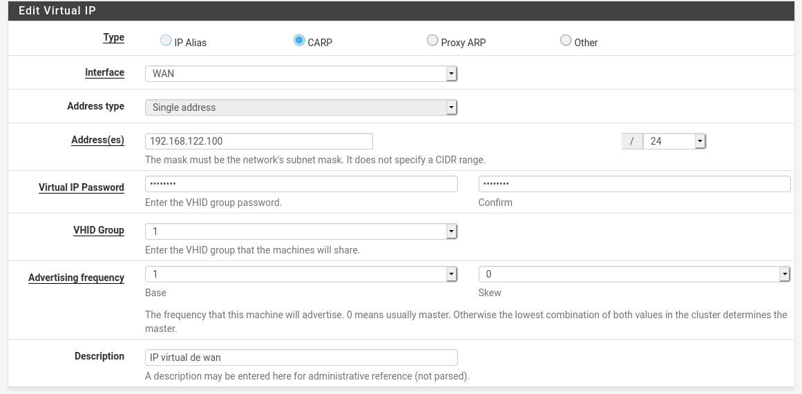

# pfsense-alta-disponibilidad
Proyecto de fin de grado

## Escenario 
Voy a realizar un escenario desplegado en libviert el cual estará compuesto por 4 maquinas las cuales dos serán pfsense y las otras dos serán Debían las cuales usaremos para realizar pruebas.

### Redes

Lo primero que configuraremos en Libvirt serán las redes.

En principio crearemos un total de 4 redes.

1. default

La red por defecto es la red que tiene un nat hacia mi tarjeta de red real de mi maquina.
Es la red que usaremos para simular la salida a internet.
Tendrá un direccionamiento de 192.168.122.0/24 y sera la única red que tenga activado el dhcp.

2. exter

Es la red extermina de nuestra lan como su propio nombre indica, sera la red que albergue uno de los servidores de debían simulando un fromten.
Tendrá un direccionamiento de 10.10.10.0/24 y no tendrá habilitado el dhcp puesto que de eso se encargar los servidores de pfsense.

3. intra

Es la red interna de nuestra lan, sera la red que albergue uno de los servidores de debían simulando un backend.
Tendrá un direccionamiento de 10.10.20.0/24 y no tendrá habilitado el dhcp puesto que de eso se encargar los servidores de pfsense.

4. net-pfsense

Esta red es una red necesaria para configurar pfsense en alta disponibilidad.
Tendrá un direccionamiento de 10.10.0.0/24 y no tendrá habilitado el dhcp.

Todas estas redes estan definidas por medio de xml el cual se encuentra en el repositorio de github.

### maquinas

Primero crearemos las dos maquinas debían, para ello utilizaremos la herramienta __virt-builder__ para crear la imagen y luego los xml para definir las maquinas.

```
virt-builder debian-10 --hostname db --format qcow2 --root-password password:root --size 10G -o db.qcow2

virt-builder debian-10 --hostname web --format qcow2 --root-password password:root --size 10G -o web.qcow2
```

Y las definiremos con los xml que se encuentran en el repositorio de github.

```
define web.xml

define db.xml
```

### instalación de pfsense

Para la instalación de pfsense, he utilizado la herrmienta de libvier __virt-install__.

```
# Pfsense master

virt-install --connect qemu:///system --cdrom ~/Iso/pfSense-CE-2.5.0-RELEASE-amd64.iso --disk size=10,pool="MVs" --network network=default --network network=exter --network network=intra --network network=net-pfsense --name pfsense-master --memory 1024 --vcpus 1

# Pfsense slave

virt-install --connect qemu:///system --cdrom ~/Iso/pfSense-CE-2.5.0-RELEASE-amd64.iso --disk size=10,pool="MVs" --network network=default --network network=exter --network network=intra --network network=net-pfsense --name pfsense-slave --memory 1024 --vcpus 1
```

Tras ejecutar esto nos abrira una ventana con el instalador de pfsense en el primer paso pulsaremos en install


Luego nos pedira el idioma del teclado, buscaremos spanish y probaremos las teclas en test keymap si todo esta correcto pulsaremos continuar.


Despues nos pedira que configuremos las particiones, aqui tenemos varias opciones, tenemos las opciones de auto particionado tanto para bios como para uefi la creara unicamente un particion / en el systema de archivos ufs y una linux swap.


Pero tambine tenemos la opción de auto zsh la cual creara el mismo esquema de particiones pero con el sistema de archivos zfs el cual es mucho mas potente y nos ofrece nuevas configuraciones como la de crear raid.


Por ultimo y no menos importante siempre podremos entrar en una configuración manual de las particiones.


Una vez configurado todo esto pararemos a la instalación, una de las cosas que mas me ha sorprendido de pfsense es que se instala en menos de 5 minutos puesto que es un software que pesar de tener muchas funcionalidades es muy liviano.

Tras la instalación nos encontraremos con una pestaña la cual nos pedirá reiniciar o nos ofrecerá un shell para poder configurar cualquier detalle a mano.


Tras reiniciar nos encontraremos que automáticamente a configurado la primera red como WAN y la segunda como Lan.
Esto es un problema puesto que desde la Wan no tenemos reglas creadas para poder acceder a la web de pfsense donde terminaremos la configuración.

Por lo que tendremos que crear dos nuevas reglas en el firewall en la red de wan.


Para ello seleccionaremos la opción 8 y entraremos en la shell de pfsense.

```
easyrule pass wan tcp any any 80
easyrule pass wan tcp any any 443
```

Una vez creadas estas reglas podremos acceder a la pagina de configuración de pfsense.

Lo primero que encontramos es una bienvenida y algunas políticas.
pulsaremos siguiente y seguiremos.


Aquí configuraremos el nombre y el dominio.


Luego configuraremos el servidor de hora.


Después podremos configurar la interfaz wan, nosotros la dejaremos por defecto.


Por ultimo nos pedirá que cambiemos la contraseña del administrador puesto que por defecto es "pfsense".


Aquí tendremos un resumen de la instalación y si queremos buscar alguna actualización, tras esto el pfsense se reiniciara de nuevo y ya tendremos instalado nuestro primer pfsense.


Recordemos que para configurar lo en alta disponibilidad necesitaremos como mínimo otro mas.

## Configuración de pfsense

### Configuración de las interfaces

Por defecto en principio solo se abra configurado la red wan y una de las primeras redes, por lo que tendremos que añadir mas.

Para ello iremos a la pestaña InterfacesInterface / Assignments y añadiremos todas las interfaces.


Tras guardarlas iremos a configurarlas 1 a 1 en la pestaña interfaces.

La primera sera la wan la cual la cambiaremos la dirección del dhcp por una ip statica y añadiremos en la pestaña _ipv4 address_ la direción que le corresponda.


Luego en las demás interfaces realizaremos los mismos cambios con sus respectivas ips.


Las interfaces deben quedar asi configuradas.

* Maestro


* Esclavo


### Configuración de High Availability Sync

Lo primero que haremos es ir al cortafuegos y habilitar el trafico en la red que usaran exclusivamente los pfsense.

En mi caso esa sera la tercera red (Pfsync)


Tras permitir todo el trafico en la red lo siguiente que haremos sera ver que tenemos ping entre la maquina para ello utilizaremos una utilizada de la pagina para realizar los ping, la encontraremos en Diagnostics / ping.


Después de comprobar la conexión primero iremos al servidor maestro y realizaremos los siguientes cambios.

Iremos a systema / High Availability Sync


Marcaremos la casilla de _Synchronize states_, en _Synchronize Interface_ añadiremos la interfaz que van a realizar la sincronizaron y en _pfsync Synchronize Peer IP_ la ip de la maquina esclava.

Seguidamente en _Synchronize Config to IP_ añadiremos de nuevo la ip de la maquina esclava, y en _Remote System_ las credenciales de una cuenta administradora de la maquina escava.


Por ultimo seleccionaremos los servicios que se sincronizaran, en mi caso he seleccionado todos.

Tras guardad esta configuración iremos a el servidor esclavo a hacer una configuración similar.

Iremos a la misma pestaña systema / High Availability Sync


y configuraremos los dos primeros campos igual que el maestro y en _pfsync Synchronize Peer IP_ pondremos la ip del maestro.

Tras eso guardaremos y ya deberíamos tener sincronizado los pfsense.

__Importante__: Puede que tengas errores en la sincronización si algún pfsense no tiene la misma versión que el resto o no utilice el mismo puerto para la interfaz web.


Recomiendo actualizar los dos pfsense antes de la sincronización


Recomiendo que todos estén configurado por https antes de la sincronización

### Configuración de Ip Virtuales.

Lo siguiente que haremos sera crear ips virtuales para cuando el servidor maestro o el esclavo se caigan no tener que esperar que los clientes cambien de ip.

Para ello nos iremos en el pfsense maestro a Firewall/Virtual IPs y crearemos la ip virtual de la red wan.



El tipo de ip seleccionaremos para que utilicé el protocolo CARP, en address añadiremos la ip que vamos a crear, y en virtual ip password pondremos una contraseña.

Realizaremos esto tanto con la externa como con la interna.


Tras realizar esta configuración en el pfsense maestro podemos probar la configuración de la alta disponibilidad puesto que devenían haberse creado las mismas ips virtuales en el pfsense esclavo.


Tras comprobar esto ya tendremos configurado las virtual ip

### Configuración del dhcp

Para configura el dhcp iremos a Services/DHCP Server y ahi realizaremos la siguiente configuración con las redes interna y externa.


Marcaremos la señal de enable para activar el servidor dhcp, y configuraremos el rango de ips que queremos que reparta.


Después configuraremos el DNs


Y la puerta de enlace que sera la ip virtual que hemos creado para la red externa.


Por ultimo también configuraremos la red interna igual que la externa.


### Configuración del SNat

Tras configurar el DHCP tendremos que configura el Snat para que los clientes de las redes externas y internas puedan salir a internet.

Para ello iremos a Firewall/NAT/Outbound y crearemos una nueva regla.


La interfaz sera la wan, la red de la que viene la redireción en este caso 10.10.10.0/24


y tendremos que poner la interfaz de salida la cual es importante que sea la ip virtual que creamos antes.

Luego haremos lo mismo con la red interna.


Asi es como tendría que quedar el conjunto de reglas.


### Configuración del Alisas

Pfsense ofrece la posibilidad de crear grupos de ips puertos y url para usar en las reglas del firewall.

Crearemos un grupo de puertos que usaremos mas tarde de la siguiente firma.

Iremos a Firewall/Aliases.


Añadiremos los puertos necesarios para salir a internet y pulsaremos guardad.


### Configurar firewall para salir a internet.

Crearemos una nueva regla en la red externa de la siguiente forma.

Entraremos en Firewall / rules y pulsaremos añadir.


Aquí la inteface que seleccionaremos sera externa, la familia sera ipv 4 y el protocolo sera tanto udp como tcp, en source dejaremos externa net.


Por ultimo en destinatión port escribiremos _Internet_ que es el alias que creamos en el apartado anterior.

Para finalizar haremos lo mismo para la red interna.


Asi es como tendría que quedar


